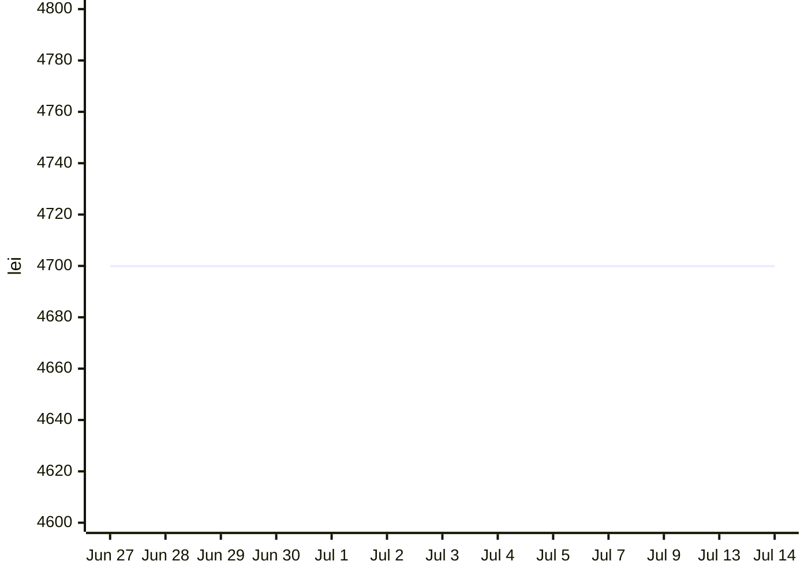
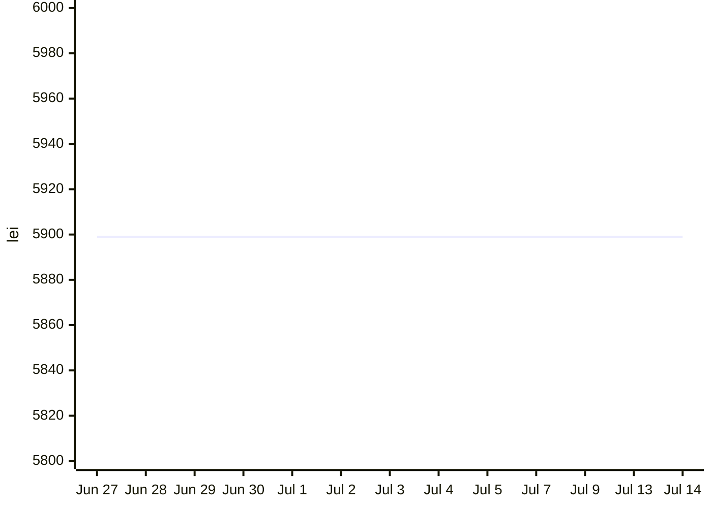

# Laptop Price Monitor

Automated daily price tracking for 3 AMD laptops available in Romania, powered by a Claude Code cloud agent.

## Monitored Laptops

| # | Laptop | Retailer | Baseline Price | Price Source | Product Link |
|---|--------|----------|---------------|--------------|--------------|
| 1 | Lenovo IdeaPad Slim 5 16AKP10 | Altex | 4,699.90 lei | WebFetch (direct) | [View](https://altex.ro/laptop-lenovo-ideapad-slim-5-16akp10-amd-ryzen-ai-7-350-pana-la-5-0-ghz-16-2-8k-oled-32gb-ssd-1tb-amd-radeon-860m-free-dos-cosmic-blue/cpd/LAP83HY0036RM/) |
| 2 | ASUS Vivobook S16 M3607GA | eMAG | 5,899.99 lei | compari.ro aggregator | [View](https://www.emag.ro/laptop-asus-vivobook-s16-m3607ga-cu-procesor-amd-ryzentm-ai-7-445-pana-la-4-6ghz-16-full-hd-oled-32gb-ddr5-ram-1tb-ssd-amd-radeontm-840m-graphics-windows-11-home-matte-gray-m3607ga-sh061w/pd/D55KJM2BM/) |
| 3 | Lenovo Yoga Slim 7 14AGP11 | eMAG | 6,999.99 lei | ⚠ Currently unavailable | [View](https://www.emag.ro/laptop-lenovo-yoga-slim-7-14agp11-cu-procesor-amd-ryzentm-ai-7-445-pana-la-4-6ghz-14-2-8k-wqxga-oled-32gb-lpddr5x-ram-1tb-ssd-amd-radeontm-840m-graphics-windows-11-pro-tidal-teal-3y-on-site-premium-ca/pd/DNGQL32BM/) |

All three laptops have an **AMD Ryzen AI 7** CPU and **32 GB RAM**, selected as the best-value options under 7,000 RON available in Romania as of June 2026.

## Price Evolution

*Updated daily by the cloud routine. Data points with `UNAVAILABLE` status are omitted.*

<!-- PRICE_CHART_START -->
### Lenovo IdeaPad Slim 5 16AKP10 (Altex)

### ASUS Vivobook S16 M3607GA (eMAG)

### Lenovo Yoga Slim 7 14AGP11 (eMAG)
_No price data available yet._

<!-- PRICE_CHART_END -->

## How It Works

A Claude Code cloud routine runs **every day at 9am Romania time** and:

1. Checks current prices using WebFetch (Altex) and Romanian price aggregators (eMAG products)
2. Compares against baseline prices established on 2026-06-27
3. Appends one row per laptop to `price_history.csv`
4. Regenerates the Price Evolution charts in this README
5. Commits and pushes both files to this repo

## Price Sources

eMAG.ro blocks direct HTTP requests (HTTP 403). Prices for eMAG products are sourced from:
- **compari.ro** — Romanian price aggregator that pulls live eMAG listings
- **price.ro** — fallback aggregator

The agent validates that the fetched price corresponds to the correct 32GB variant and rejects reseller or wrong-spec listings.

> **Note:** The Lenovo Yoga Slim 7 14AGP11 (product ID: DNGQL32BM) is not yet indexed on any accessible aggregator. Its price row will show `UNAVAILABLE` until it appears on compari.ro or price.ro. Check manually at the product link above.

## Price History

All price checks are stored in [`price_history.csv`](./price_history.csv).

| Column | Description |
|--------|-------------|
| `date` | Date of the check (YYYY-MM-DD) |
| `product` | Laptop model name |
| `retailer` | Store (Altex or eMAG) |
| `url` | Direct product page link |
| `baseline_lei` | Price on 2026-06-27 (monitoring start) |
| `current_lei` | Price at time of check |
| `change_lei` | Absolute change in lei (negative = cheaper) |
| `change_pct` | Percentage change rounded to 2 decimals |
| `direction` | DOWN / UP / NO_CHANGE / UNAVAILABLE |
| `in_stock` | YES / NO / UNKNOWN |
| `note` | Price source and any promo observed |

## Schedule

| | |
|----|-----|
| **Frequency** | Daily at 9am Romania time (06:00 UTC) |
| **Period** | 2026-06-27 — 2026-09-25 (90 days) |
| **Powered by** | [Claude Code](https://claude.ai/code) cloud routines |
| **Routine** | [View on Claude](https://claude.ai/code/routines/trig_01HiZPB71GPn4qcYz4i1BFhX) |
